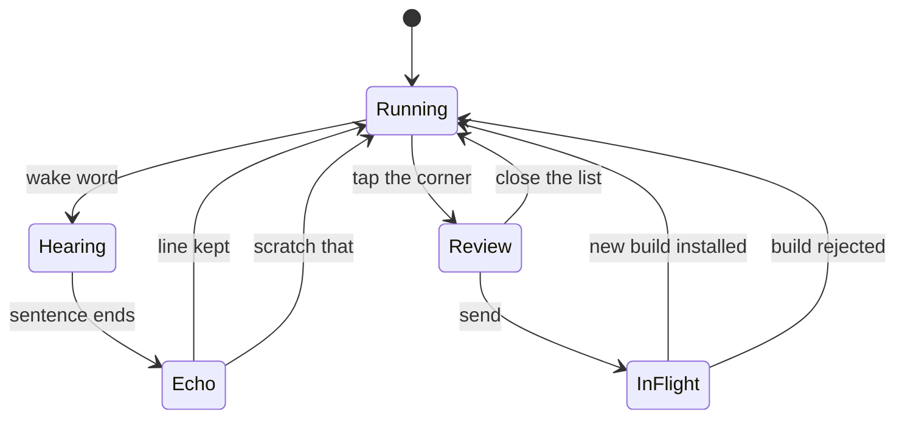
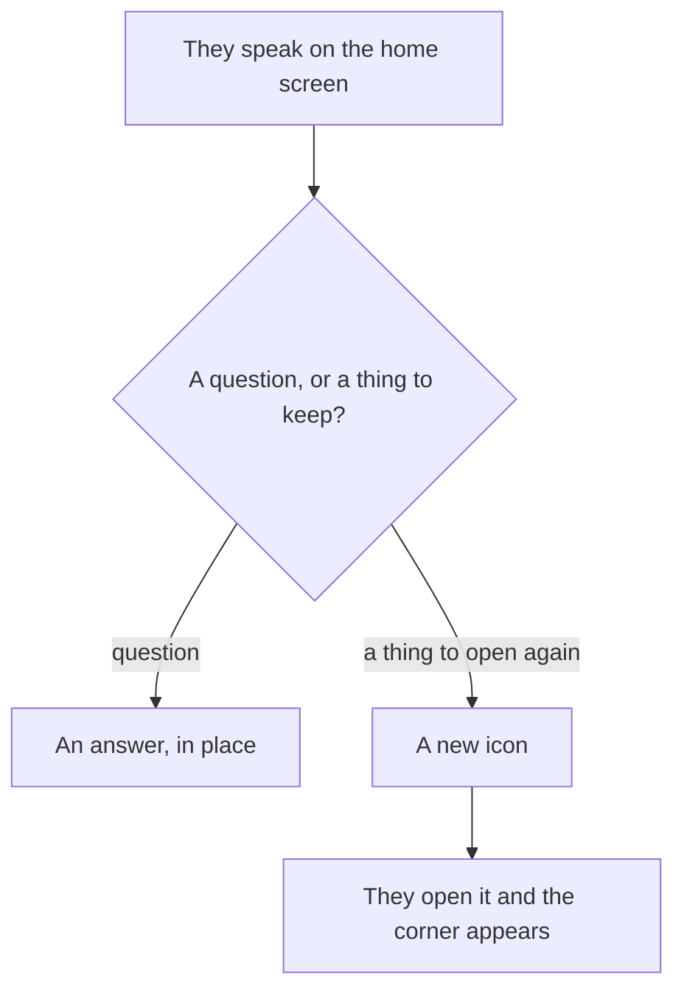

# Omakone — detailed plan

The behavior is in the [README](README.md). This is the same product, specified tightly enough to build: the rules, the states, and the order of work.

The idea started from Thomas Ptacek's post [What Even Is An OS Now?](https://sockpuppet.org/blog/2026/09/25/what-even-is-an-os-now/) (25 September 2026): most future apps have an audience of one or two people, people conjure them in ordinary language, and a computer built only to run fixed apps from strangers is the wrong shape. Omakone takes the further step that post leaves open. The person holding the device has no technical background. They do not edit configs, choose a toolchain, or watch files appear. The only way software arrives is by asking for a gadget. The device can also just answer a question.

## Words

| Word | Meaning |
| --- | --- |
| Device | The object. Screen, microphone, apps, corner. |
| Home | The screen of icons, where they ask or request a new app. |
| App | One icon, one sandboxed program, one saved-data box. |
| Frame | The rectangle the app draws into. |
| Corner | The shell bar under the frame. The hint and the last line live here. Always visible inside an app, and outside the picture. |
| Note | One utterance plus the frame captured when it started. |
| Batch | The unsent notes for the build currently on screen. |
| Build | One installed version of an app. |
| Workshop | The off-device place that keeps the hidden project, runs the model, and compiles. |
| Grant | A power the person turned on on purpose. Sending, paying, location, and the like. |
| Box | The app's sandbox: its program, its saved data, its grants. Nothing else. |

## The rules

1. The person never sees source, a file manager, a package manager, or a toolchain.
2. Software arrives as an icon, or as a new version of an icon they already have.
3. Home speech either answers a question or makes an icon. Inside an app, the wake word only annotates that app.
4. The corner always shows `say "omakone" for feedback`.
5. After they speak, the corner shows the last line, so a mishear is visible.
6. `omakone, scratch that` drops the last line and its picture. Only the last line, and only while it is the one showing.
7. A note stores the words and the app frame from the start of the utterance. The corner is not in the picture.
8. Notes accumulate on the device. Generation starts when they send, and not before.
9. They send from the corner, by looking at the lines and confirming. A spoken "send" is another note, so send is not a voice command.
10. The workshop patches the hidden project for that app. Unmentioned behavior stays. The running session is not hot-reloaded.
11. The same icon keeps its saved data across a successful update. A build that cannot open the previous data is not installed.
12. A patch cannot add a grant. A grant is a separate confirmation.
13. One batch is in flight at a time. Notes taken afterward stay on the device until the new build is what they are looking at, and they send again.
14. Before install, the workshop checks that the build runs, stays in its box, and declares only grants the app already has.
15. Removing an icon deletes that app's box on the device and its project in the workshop. Effects that already left the device are not undone.

## The person and the session

The person is the test. They notice a wide sidebar because they are looking at it, and they say so without leaving the app. Their attention is the acceptance test. The workshop does not spend a giant automated pass trying to guess whether the gadget is the right gadget.

They can keep using the app the whole time. Speaking is a side channel. The current build stays still so the thing they are judging does not move under their hands.

The wake word is `omakone`. It is stripped from the stored sentence. `omakone, this sidebar is too wide` is stored as `this sidebar is too wide`.

On home, the same word starts a request: answer me, or make me an icon. Inside an app, it never creates a different app and never answers a general question. A new gadget starts from home. That split is what keeps "make the text white" from being heard as "make me a new app."

They speak in the language they actually speak. Notes are stored as said.

## The corner

The shell owns the corner and the microphone's wake word. The app does not draw the hint, does not see the echoed line, and does not listen for `omakone`. The frame is the layout box the app gets; the corner occupies the rest, as a bar along the bottom. Nothing the app cares about sits under it, because the app was never given that area.

While they are inside an app, the corner shows:

- the permanent hint, `say "omakone" for feedback`
- the last line heard, until the next line replaces it or they scratch it
- the count of notes waiting in the batch
- if a change is already in flight, a short line that this version is still the current one

Tap the corner to open the batch: the sentences, in order. From that list they can drop a line, or send. Opening the list does not send. Sending is a separate confirmation on the list, so a stray tap does not start a rebuild.

Scratch by voice removes only the line currently echoed, and the picture stored with it. Lines already above it in the batch stay. Dropping a line from the open list removes that line and its picture wherever it sits.

The batch is short, on the order of a dozen notes. When it is full, the corner asks them to send or drop before it keeps more. Unsent pictures are the thing that would otherwise fill a small device.

## Pictures and the prompt

Capture fires at the start of the utterance, once the wake word has been recognized, before they finish the sentence. That is the screen the word "this" refers to. If they navigate while still talking, the picture stays the one from the start.

The stored record for a note:

- the build id on screen
- the sentence, without the wake word
- the frame image
- the time

On send, the workshop receives the notes in order. Labels are positional in that message. The first image is Picture 1, the second is Picture 2. Scratch a line before send and the later pictures renumber. The prompt the model sees looks like this:

```
[Picture 1] this sidebar is too wide
[Picture 2] the text should be white on black instead of black on white
```

Each picture is the frame buffer. The hint, the echo, and the note count are shell pixels and are not composited in.

The batch leaves the device on send. Until then it stays on the device. Transcription has to be good enough for the echo to be fair; the words they see are the words that will be sent. Audio and pictures for a scratched line are discarded.

## States



| State | What they experience |
| --- | --- |
| Running | The app works. The hint is up. Waiting notes show as a count, and the last line if there is one. |
| Hearing | The frame has been captured. Words fill in on the corner as they settle. |
| Echo | The finished line is on the corner. Scratch drops it. Otherwise it joins the batch, and the corner goes back to Running with that line still visible. |
| Review | The waiting sentences are listed. Drop or send. |
| In flight | They are still in the current build. The corner says the change is being made. Send is closed. New notes may still be recorded, and they wait. |

Hearing and Echo do not block the app. They can scroll, tap, and keep working. The captured frame does not follow them.

## One batch in flight

Notes always describe the build that was on screen when the picture was taken.

They send batch A against build 3. The workshop patches build 3's project. While that runs, they are still looking at build 3. Any new notes are batch B, also pictured against build 3, and they are not folded into the patch already running. "The sidebar" in batch B must not be applied to a layout batch A is already changing.

Sending stays closed until a build is installed or the attempt fails. Then:

- On success, the next open is build 4. Batch B is still unsent. The corner shows those lines as spoken about the previous version, and they choose what still applies. What they send is patched onto build 4, with the old pictures labeled as the previous screen.
- On failure, they are still on build 3. The corner says it couldn't be done. Batch A is still there to edit and send again. Batch B is appended behind it, since both describe build 3.

There is no silent swap. Open the icon and it is either the version they already know, or the new one with the corner saying it changed.

## The hidden project

Each app has one project in the workshop. The person has no view of it, no branch name, and no diff. The device stores the build id it is running so the workshop knows what they were looking at.

A send is a patch on top of that build, not a fresh app. The instruction to the model is the existing project plus the prompt above, with these constraints written in:

- Change what the notes describe.
- Leave every unmentioned behavior in place.
- Leave saved-data format readable by the new build, or include a migration that runs from the previous format.
- Do not add grants. If a note seems to need one, stop and return a question instead of a binary.

The sidebar example, applied: width and text color change. List order, the saved entries, the grants, and every screen they did not show stay as they were.

If the model cannot do it without breaking saved data or without a new grant, the device gets a refusal in plain language, not a broken icon. The previous build remains installed.

## Install check

The person's session is the real test. The automatic check before a binary is installed is small and strict:

- it starts
- it stays inside its box
- its declared grants are a subset of the grants already on the device for this app
- it opens a copy of the previous saved data

Fail any of those and the install does not happen. The check does not try to decide whether the sidebar is the right width. They will, the next time they open it, and they will say so.

## Grants

Powers that leave the device, or that read a private sensor, are implemented by the shell. The app calls them. It does not reach the network, the camera, location, contacts, or payments on its own.

A grant is a sentence on screen and a yes. It is a different act from a note. A feedback line that says "it should also send the photo" comes back as a question, and the patch that only fixes the sidebar ships with the old grants. The yes, if they give it, is the moment the manifest grows, and the following build may use the new power.

Grants are visible from the app's place on the home screen, in language a non-programmer can read, and can be turned off. Turning one off sticks. The next patch still cannot turn it back on.

Effects inside the box can be wiped. A sent photo, a payment, or a posted message cannot. Those happen only after the grant exists and the app takes the action, which is why the grant is deliberate and slow.

The concrete list of powers for a first version is an open choice. The mechanism is not: shell-owned, listed, confirmed, and impossible to grow from a feedback transcript.

## The box and the base

Each app runs in its own box. It sees its frame, its saved data, and its grants. It does not see other apps, the base system, or its own source. Clearing an app wipes the box and leaves the icon in a fresh state, or removes the icon entirely. Removal also deletes the workshop project.

The base system is one image. It does not collect packages, drivers for other people's hardware, or a second form factor. Device updates replace that image as a whole. App updates are not device updates. The base is what makes "immutable, plus icons" a product rather than a general computer with a skin.

The device is sized for the base, one running app, and a short batch of pictures. The model, the compiler, and the project history are in the workshop, so they are not part of that budget. A working target is a machine that is comfortable in a gigabyte or two, because the memory is not being spent on a local model or on a general-purpose desktop stack. The screen, the battery, and the radio will dominate the cost of the object. The memory target matters because it forces the base and the apps to stay small.

What the app is written in is secondary to three constraints: the binary is small, it draws only in the frame, and it can only leave the box through grants. One interface vocabulary, used for every app, so the workshop is patching a stack it is fluent in. Which vocabulary that is remains open. It has to be one.

## Home



The home request that creates an icon is the first prompt. It has no picture yet, because there is no app. The workshop creates the project, builds it, runs the install check, and the icon appears when the build is installed. Until then the home screen says it is making the thing, and they can keep using the icons they already have.

A question does not create an icon. If the answer is something they would open again, the device can offer to make it into one. The offer is a yes of the same kind as a grant: explicit, and skippable.

## What the first version is not

- Not a phone, a tablet, and a laptop. One body, chosen once. Apps are laid out for that screen and that input.
- Not a local model. Listening enough to show the echo can be local; writing and compiling the app cannot.
- Not a store of apps made by strangers. Icons on this device were made for this person.
- Not a hot reload. The session they are in is stable.
- Not an automatic judgment of whether the gadget is good. That judgment is the next thing they say.
- Not a general operating system for arbitrary hardware. The swamp of drivers, input methods, and form factors is avoided by having one object.

## Worked session

This is the acceptance script for the loop. A version that does this has the product in it.

1. Home is empty. They say they want a list of the three ways home, and an icon named for that appears.
2. They open it. The corner reads `say "omakone" for feedback`. The list is usable.
3. They say the sidebar is too wide. The corner shows that sentence. The stored picture is the frame from the start of the sentence, with no corner in it.
4. They keep scrolling. They say the text should be white on black. The corner shows the new sentence. The count is 2.
5. They say `omakone, scratch that`, then say the color sentence again more clearly. The count is still 2. The scratched picture is gone.
6. They tap the corner, read both lines, and send. The app does not change. The corner says the change is being made.
7. They say one more note before the build returns. It is kept. Send stays closed.
8. The workshop patches the existing project. Width and color change. The three saved entries remain. No new grant appears.
9. They open the icon before the build is back. Same screen as step 2, plus the corner explaining it is still this version.
10. The build arrives. The next open has the narrower list and light-on-dark text. The entries are still there. The held note from step 7 is offered as a note about the previous screen. They can drop it or send it as the next patch.

## Order of work

The device people hold comes last. The loop is the product, and it can be proven on one fixed screen before any custom hardware exists. Each step is done when the script above gets further.

1. **Shell.** One fixed screen. Home with icons. A frame and a corner. The hint, the echo, scratch, the count, the review list, and send. No model yet: sending can append the prompt to a log so the capture and the wording can be checked by eye.
2. **Prompt.** Pictures line up with sentences. Picture 1 is the first image. The corner is absent from every image. Scratch renumbers. The batch survives leaving the app, and dies if the icon is removed.
3. **One app, patched.** A real hidden project. Send produces a patch of the existing app, a binary, and an install over the same icon. Saved data survives. The session that sent the batch is not reloaded under them. In-flight rules from the script's steps 6 through 10 hold.
4. **Grants.** A manifest on the icon. One power, end to end, with its own yes. A feedback line that asks for a new power returns a question and does not change the manifest. Turning the power off sticks across a later patch.
5. **Install check.** Boot, box, grant subset, and opening the previous saved data. A deliberate bad build is refused and the old icon remains.
6. **Home requests.** A spoken request creates the first icon. A question returns an answer and no icon.
7. **The object.** The base image, the memory budget, one body, the microphone, and selling it as one thing. The loop above does not change to fit the hardware. The hardware is built to run the loop.

## Open choices

These are real, and they are not answered by the rules above.

- The body. One screen and a microphone are required. Handheld or otherwise is a product choice, made once.
- The interface vocabulary every app is built from. It has to be small, stable, and something the model patches reliably.
- Which grants exist in the first version that goes home with someone. Start with one that is easy to understand and hard to undo, so the confirmation is forced to be good.
- Where full transcription runs, if a small on-device recognizer cannot show a fair echo. Generation still waits for send either way.
- How home tells a question from a request for an icon, beyond the explicit offer to turn an answer into one.
- The exact cap on a batch. A dozen is the working assumption.
