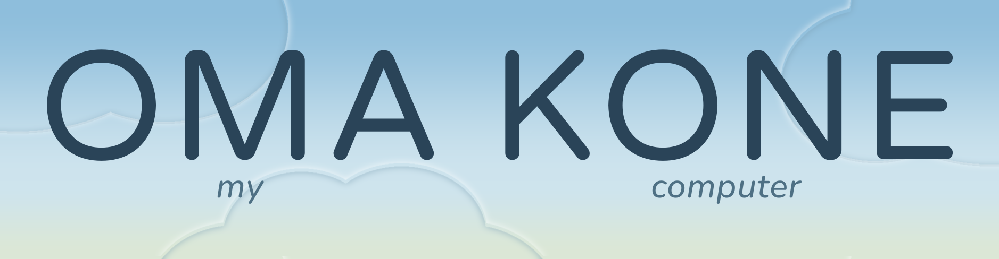

# Omakone

Omakone is one person's computer. They speak to it. It answers. When they want a tool of their own, an icon appears. They never see the files behind the icon.

The name is the wake word. *Oma kone* — my computer.

## The object

One device. One screen. A microphone. The software is part of the object, sold together with it. There is nothing to install, and no second machine the person is expected to own.

```
        ┌────────────────────────────────┐
        │                                │
        │      ┌────┐       ┌────┐       │
        │      │    │       │    │       │
        │      └────┘       └────┘       │
        │      exits        photos       │
        │                                │
        │                                │
        │     speak, to ask or to make   │
        └────────────────────────────────┘
                         home
```

On the home screen they talk.

- A question gets an answer.
- A thing they would open again becomes an icon.

That icon is the whole app. No folder, no project, no settings maze.

## Inside an app

The app sits in a frame. The corner belongs to the device, not to the app: a bar along the bottom edge, always there. It never covers the app, and it is never part of the picture.

```
        ┌────────────────────────────────┐
        │ ┌────────────────────────────┐ │
        │ │                            │ │
        │ │  exits              list   │ │
        │ │  ┌──────────────────────┐  │ │
        │ │  │ Roosevelt            │  │ │
        │ │  │ Madison              │  │ │
        │ │  │ Lake                 │  │ │
        │ │  └──────────────────────┘  │ │
        │ │                            │ │
        │ └────────────────────────────┘ │
        │ say "omakone" for feedback     │
        │ "this sidebar is too wide"     │
        │                         2 notes│
        └────────────────────────────────┘
          frame above, corner below
```

They keep using the app. When something is wrong, they say:

> omakone, this sidebar is too wide

The corner repeats the words, so they can see the device heard them. They go on using it. Later:

> omakone, the text should be white on black instead of black on white

If the corner shows the wrong words, they say:

> omakone, scratch that

The last line is dropped. Older lines stay.

Nothing about the app changes until they decide to send. They tap the corner, see the waiting lines, and send.

## What the send contains

Each sentence is tied to the screen they were looking at when they started saying it. The message is a stack of pictures and lines. Picture 1 is simply the first picture in the message.

```
   Picture 1                          Picture 2
   ┌──────────────┐                   ┌──────────────┐
   │  list        │                   │  black text  │
   │  (too wide)  │                   │  on white    │
   └──────────────┘                   └──────────────┘
   this sidebar is too wide           the text should be
                                      white on black
```

```
[Picture 1] this sidebar is too wide
[Picture 2] the text should be white on black instead of black on white
```

The picture is the app frame alone. The corner, the hint, and the echoed words are left out, so the change is about the app.

## What comes back

The same icon. The things they saved are still there. The sidebar is narrower. The text is light on dark. Anything they did not mention is unchanged.

The app does not change while they are in it. They are always touching the current version. When the new one is ready, the next open is the new one. If they open it before that, it is still the old one, and the corner says the change is still being made.

```
   say it  →  see the words  →  keep using it  →  send when ready
                                      │
                                      ▼
                         same icon, saved things kept
                         only the mentioned parts move
```

## Two kinds of sentence

A note about how the app looks or behaves rides along in the batch.

A new power does not. Sending a photo, paying, posting, or anything else that leaves the device is its own question, asked on purpose, with its own yes. Landing in the transcript is not that yes.

## Where the work happens

The device shows the app, listens, and holds the notes until send. Somewhere else, a workshop keeps a project for that app, hidden from them, and changes only the parts they talked about. The model that writes the change is not inside the device.

```
   ┌─────────────┐      notes + pictures, on send      ┌──────────────┐
   │   device    │ ─────────────────────────────────► │   workshop   │
   │             │                                    │              │
   │  screen     │ ◄───────────────────────────────── │  the project │
   │  microphone │   same icon, same saved things     │  the model   │
   │  the apps   │                                    │  the build   │
   └─────────────┘                                    └──────────────┘
        │
        notes and pictures stay on the device until they send
```

Removing an icon clears that app off the device: its saved things, and the powers it had been given. What it already did out in the world — a photo already sent — stays done.

## Who it is for

Someone who will never look at source. A child. A driver. Anyone who can say, out loud, what is wrong with the thing on the screen. The computer's job is to meet them there.

The rules, states, and build order are in [COMPLEX_PLAN](COMPLEX_PLAN.md).
